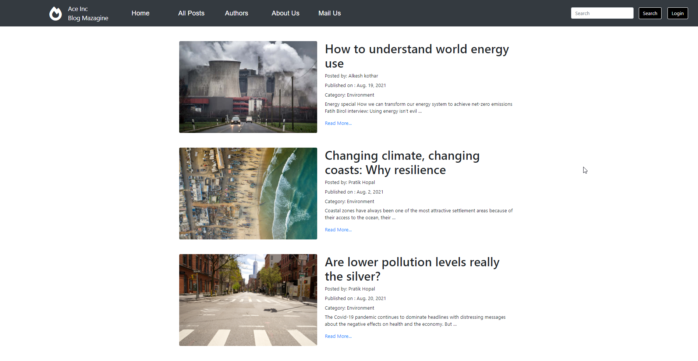

# Ace-Inc Blogging: A Blogging Project Using DJango
(Please wait for screenshots to load thank you)

A Simple Blogging Website where we can post multiple blogs depending on which category the user wishes to post on.
The vistors can either view the Blog or view the Author.
This project is simply a pratical of my Django learing where I have implemented all my learning skills into pratice.

### Features: 
Cateory based view 
Blog based comment 
User login 
Blog and Author view 

This Project is build using: Django, HTML, CSS and Bootstrap3  
Below are the screenshot for the project

Thanks for visiting.

